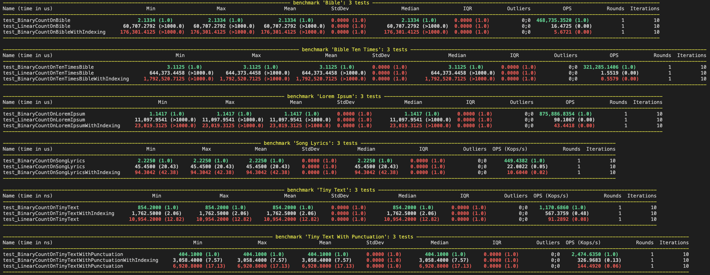
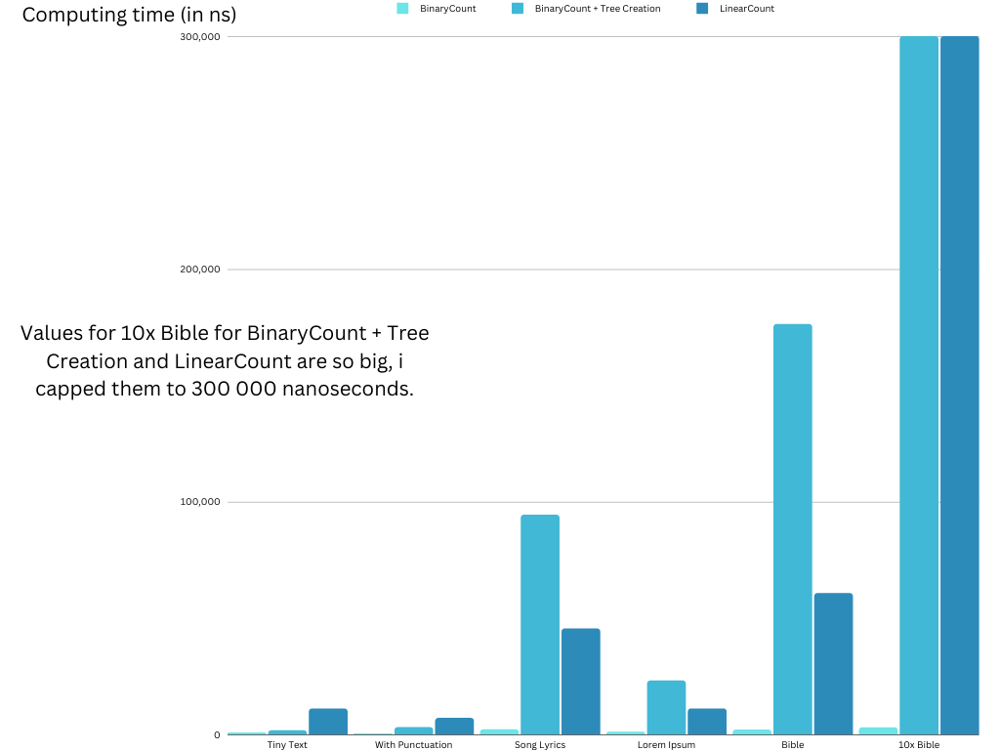

# Assignment n°2: Searching Algorithm

*Every code part is written in Python.*

Firstly, I developed the 2 asked functions:

- LinearCount
- BinaryCount

The first function use a linear algorithm in order to found the number of occurrence of the searched file, making a loop to iterate over a list of words.

When the word is found, a counter is incremented and we resume until we arrive at the end of the list.

```py
from typing import List

def LinearCount(wordList: List[str], searchedWord: str) -> int:
    word_occurrence = int(0)

    for word in wordList:
        if word.casefold() == searchedWord.casefold():
            word_occurrence += 1
    print(f"Occurence of word '{searchedWord}': {word_occurrence}")
    return word_occurrence
```

The second function I developed use a Binary Tree and a Node class.

The Binary Tree has some utils functions used in the binary tree building, such as insertion or as searching.

```py
from enum import IntEnum

class AddOnSide(IntEnum):
    UNKNOWN = -1
    LEFT = 0
    RIGHT = 1

class Node:
    def __init__(self, word):
        self.occurrence = 1
        self.leftTree = None
        self.rightTree = None
        self.word = word

class BTree:
    def __init__(self):
        self.root = None

    def isEmpty(self) -> bool:
        return self.root is None

    def getOccurrenceOfWord(self, word) -> int:
        if self.isEmpty():
            return 0
        currentNode = self.root

        while currentNode is not None:
            if word.casefold() == currentNode.word:
                return currentNode.occurrence
            elif word.casefold() < currentNode.word:
                currentNode = currentNode.leftTree
            else:
                currentNode = currentNode.rightTree
        return 0

    def insertInTree(self, word) -> None:
        sideToAdd = AddOnSide.UNKNOWN
        if self.isEmpty():
            self.root = Node(word.casefold())
            return
        parentNode = None
        currentNode = self.root

        while currentNode is not None:
            if word.casefold() < currentNode.word:
                parentNode = currentNode
                currentNode = currentNode.leftTree
                sideToAdd = AddOnSide.LEFT
            elif word.casefold() > currentNode.word:
                parentNode = currentNode
                currentNode = currentNode.rightTree
                sideToAdd = AddOnSide.RIGHT
            elif word.casefold() == currentNode.word:
                currentNode.occurrence += 1
                return
        if sideToAdd == AddOnSide.LEFT:
            parentNode.leftTree = Node(word.casefold())
        elif sideToAdd == AddOnSide.RIGHT:
            parentNode.rightTree = Node(word.casefold())

def BinaryCount(bTree: BTree, searchedWord: str, wordList: List[str] = []) -> int:
    if bTree.isEmpty():
        for word in wordList:
            bTree.insertInTree(word)

    occurrenceOfWord = bTree.getOccurrenceOfWord(searchedWord)
    print(f"Occurence of word '{searchedWord}': {occurrenceOfWord}")
    return occurrenceOfWord
```

## Question a

In order to compare both functions for various document length and structure, I made some unit tests. Theses unit tests use a Pytest Fixture called Pytest-Benchmark.

The Pytest-Benchmark makes a benchmark for the function used. On 10 iteration for each test, I was able to arrived at this result:



The results shows 3 types of benchmark:

- Linear Search
- Binary Search with Tree Creation Time
- Binary Search without Tree Creation Time

I used some text with incremented size (Phrase, Football Commentary, Lyrics of French Music, Lorem Ipsum of 2Mo, Bible).



- Real values for '10x Bible' are available in the benchmark screenshot (in microseconds).

- For each different size, the time taken by each function is different. The larger the file, the longer it takes to search.
- For each test, we can see that the Binary Tree Search is faster than the Linear Search.

We also can see that the creation of the tree can is also a parameter to think about.

In some tests on tiny file, the creation of the binary tree and the search using a Binary Search Tree is faster than the linear search.

With larger files, the creation and the search using a Binary Search Tree takes too much time.

## Question b

Concerning the maximum handled file size, the highest file size I made was 40 times the Bible in a file without crashing (1,74 Go).

Being developed with Python, I think the function I made don't have any file size limit or the file size limit would be really long to find.

The reason is the memory management of Python making any program almost impossible to make crash.

Therefore, both of my functions don't use recursion so they can't crash with recursion limit either.

The only thing that can make this functions crash would be adding a '/dev/zero' value to the end of a line in a file making the program running out of memory because the line doesn't end.

## Question c

The diversity of a document vocabulary has an influence on the search performance.

Using the binary search tree, we can ask ourselves "How can the diversity influence the search performance?".

The more different words we have, the longer the binary tree will be and the longer it will take to go through the binary tree.

If we have words that come up frequently, we will have a number of nodes that is less than the number of words in the text. Therefore we will take less time to go through the tree.
